# Grokking Https

# HTTP 的痛点及解决方案

| 痛点 | 解决方案 | 描述 |
| - | - | - |
| 窃听 | 加密 | 对称加密AES |
| 秘钥传递 | 秘钥协商 | 非对称加密（RSA和ECDHE） |
| 篡改 | 完整性校验 | 散列算法（md5、sha256）签名 |
| 身份冒充 | CA权威机构 | 散列算法（md5、sha256） + RSA签名 |

# HTTPS 中的 S 到底是什么

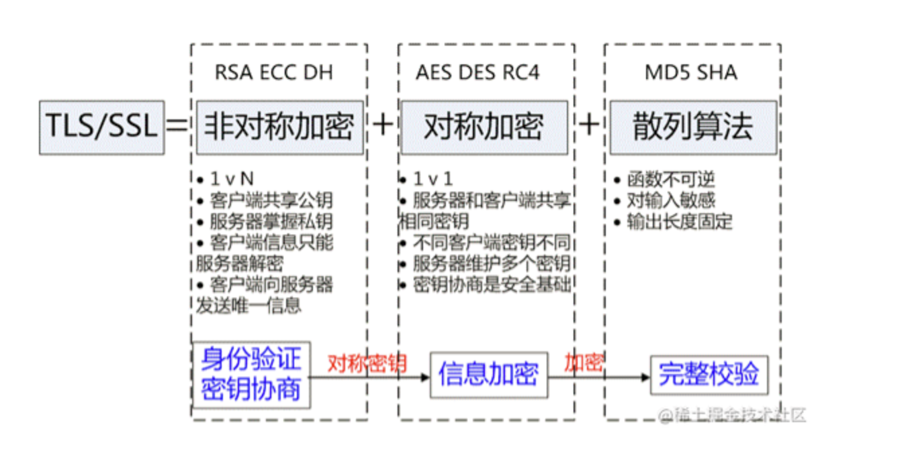

# 对称加密

- 对称加密是最快速、最简单的一种加密方式,加密(encryption)与解密(decryption)用的是同样的密钥(secret key)
- 主流的有`AES`和`DES`

## 简单实现

- 消息 `abc`
- 密钥 3
- 密文 def

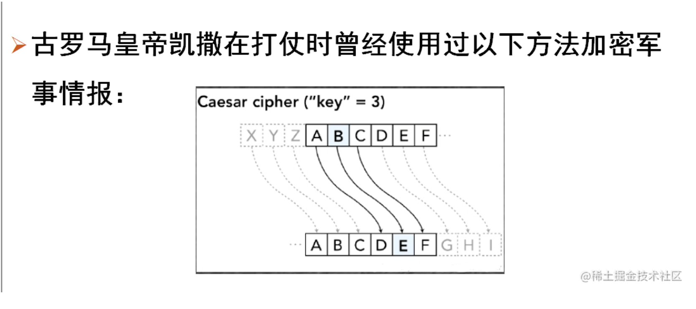

### 代码实现

``` ts
// symmetric-encryption

// encrypt key and decrypt key are the same
const secret = 3;

export function symmetricEncrypt(message: string): string {
  // convert message to buffer
  const buffer = Buffer.from(message);

  for (let i = 0; i < buffer.length; i++) {
    buffer[i] = buffer[i] + secret;
  }

  return buffer.toString();
}

export function symmetricDecrypt(message: string): string {
  // convert message to buffer
  const buffer = Buffer.from(message);

  for (let i = 0; i < buffer.length; i++) {
    buffer[i] = buffer[i] - secret;
  }

  return buffer.toString();
}
```

## DES

DES（数据加密标准，Data Encryption Standard）是一种对称密钥加密算法，于1977年被美国国家标准局（现为国家标准与技术研究院，NIST）正式采纳为联邦信息处理标准（FIPS PUB 46）。DES的设计基于一种名为Feistel网络的结构，它将64位的明文输入转换成64位的密文输出，通过执行一系列复杂的加密过程。DES使用56位的密钥进行加密和解密，加上8位用于奇偶校验，总共是64位。

尽管DES在推出时被认为是相当安全的，但随着计算能力的增长，其56位的密钥长度逐渐显示出安全性不足。到了1990年代末，通过专门的硬件攻击，DES加密可以在几个小时内被破解。这导致了对DES安全性的广泛关注和对替代加密标准的需求。

为了应对DES安全性不足的问题，NIST启动了一个用于选择DES后继者的程序，最终导致了AES（高级加密标准）的采用。尽管如此，DES的一个增强版本——3DES（也称为Triple DES）在一段时间内仍被广泛使用。3DES通过连续使用三个56位密钥对数据进行三次DES加密，从而提高了加密强度。

## AES

AES（高级加密标准，Advanced Encryption Standard）是一种广泛使用的对称加密算法，用于安全地加密和解密信息。AES是在1997年由美国国家标准与技术研究院（NIST）发起的，旨在找到一种替代旧的数据加密标准（DES）的加密算法。经过公开的竞赛和评估后，2001年，一个名为Rijndael的算法被选为AES。

AES设计为具有高强度的安全性和快速的加密速度，同时能够高效地在各种硬件和软件平台上运行。它支持多种加密密钥长度：128位、192位和256位加密，这些数字代表加密密钥的长度。加密过程中，数据被分割成块（通常是128位大小的块），然后对每个块应用多轮加密操作。

AES的使用非常广泛，包括但不限于文件和文件夹加密、安全通信协议（如SSL/TLS用于安全的网页浏览）、无线网络安全（如WPA2）以及许多其他安全敏感的应用场合。

由于其强大的安全性和广泛的适用性，AES已成为当今世界上最重要的加密标准之一。

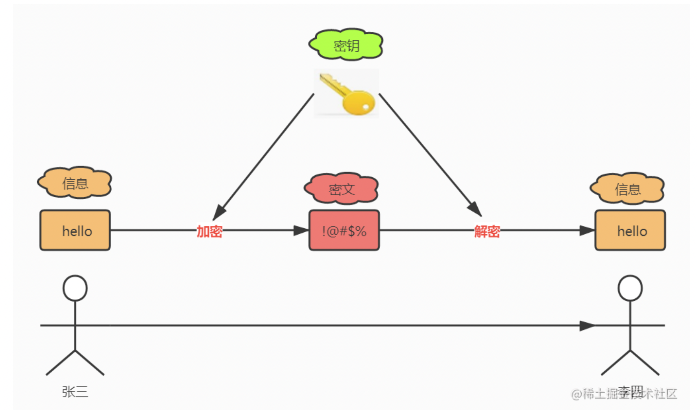

### AES 应用

``` ts
import crypto from 'crypto';

/**
 *
 * @param {*} data 数据
 * @param {*} key 秘钥
 * @param {*} iv 向量，相当于加盐
 */
export function encrypt(data: string, key: string, iv: string) {
  const cipher = crypto.createCipheriv('aes-128-cbc', key, iv);
  cipher.update(data); // 把内容传给实例
  return cipher.final('hex'); // 把结果输出成16进制的字符串
}

export function decrypt(data: string, key: string, iv: string) {
  const cipher = crypto.createDecipheriv('aes-128-cbc', key, iv);
  cipher.update(data, 'hex'); // 加密是16进制，解密也需要16进制
  return cipher.final('utf8'); // 原来是utf-8
}
```

## 加密和加盐

在计算机安全领域，加密（Encryption）和加盐（Salting）是两种常见的数据保护方法。虽然它们的目的相同——保护数据不被未经授权的人访问或理解，但它们的应用场景、原理和方法有所不同。

加密
加密是一种通过使用算法（加密算法）和密钥将明文（原始数据）转换为密文（加密数据）的过程，以防止未经授权的访问。加密的数据只能通过使用相应的密钥进行解密后才能恢复到其原始格式。加密主要用于数据传输和存储的安全。

加密算法通常分为两类：

对称加密：加密和解密使用相同的密钥。例子有AES和DES。
非对称加密：加密和解密使用不同的密钥，通常称为公钥和私钥。例子有RSA和ECC。
加盐
加盐是一种增加密码或其他敏感数据保护强度的技术，通过在原始数据（如用户密码）中添加一个随机值（称为“盐”）来实现。这样，即使两个用户的原始密码相同，加盐后的结果也会不同，这增加了破解的难度。加盐通常与散列（Hashing）一起使用，以存储密码的散列值而不是实际的密码本身。

加盐的过程大致如下：

生成一个随机的盐值。
将盐值与原始数据（如密码）结合。
对结合后的数据进行散列处理。
将盐值和散列值一起存储。
当需要验证数据（如用户登录时的密码）时，系统将采取相同的盐值和散列过程来验证输入的数据是否与存储的散列值匹配。

加盐（Salting）主要是为了防止以下几种安全威胁和攻击方式：

彩虹表攻击（Rainbow Table Attack）：彩虹表是一种预先计算好的散列值对照表，包含了大量常用密码及其散列值。如果密码存储没有加盐，攻击者可以使用彩虹表来快速查找相应的密码。加盐通过向每个密码添加一个唯一的随机值来使得即使相同的密码也会产生不同的散列值，这样就大大增加了使用彩虹表攻击的难度和成本。

字典攻击和暴力攻击（Dictionary and Brute Force Attacks）：这些攻击方法试图通过尝试可能的密码组合来猜测密码。加盐使得每个散列值的计算都基于原始密码加上一个独特的盐值，即使是相同的密码，由于盐值的不同，也会导致不同的存储散列值。这意味着攻击者无法仅通过猜测原始密码来匹配散列值，因为他们还需要知道盐值。

避免密码重复性（Avoid Password Reuse）：在没有加盐的情况下，两个用户如果使用相同的密码，那么他们的密码散列值也会是相同的。这使得攻击者可以轻易地识别出使用相同密码的账户。加盐通过为每个密码添加一个唯一的盐值，即使是相同的密码，最终存储的散列值也会不同，从而避免了这种情况。

增加破解难度（Increase Cracking Difficulty）：即使攻击者能够获得到数据库中的散列值，加盐也使得他们必须对每个盐值和密码组合单独进行攻击，而不能一次性攻击所有账户。这极大地增加了破解密码所需的时间和资源。

总结来说，加盐是为了提高存储密码时的安全性，通过使每个用户的密码散列值唯一，来防止彩虹表攻击、字典攻击、暴力攻击，并减少密码重用的风险。这是一种有效的增加攻击成本和难度的方法，保护用户数据不被未授权访问。

加密与加盐的区别
目的：加密是为了保证数据的保密性，使数据只能被拥有密钥的人理解；而加盐主要是为了增强密码或其他敏感数据在存储时的安全性，使得即使在数据泄露的情况下，也不容易被破解。
逆向操作：加密是可逆的，意味着加密的数据可以被解密恢复原始数据；加盐与散列结合使用时，是不可逆的，即无法从散列值恢复原始数据。
应用场景：加密广泛应用于数据的传输和存储保护；加盐则主要用于增强存储在数据库中的密码或其他敏感数据的安全性。

# 4. 非对称加密

对称加密的痛点：互联网上没有办法安全的交换密钥

## 单向函数

单向函数顺向计算起来非常的容易，但求逆却非常的困难
也就是说，已知x，我们很容易计算出f(x)。但已知f(x)，却很难计算出x
例如：两瓶饮料倒在一起很容易合成，但分解很难，非对称加密原理基于此

## RSA算法

[RSA算法详解](https://juejin.cn/post/6844903559582973959)

我们知道像RSA这种非对称加密算法很安全，那么到底为什么安全呢？

- m：要加密的数据
- p, q：我们随机挑选的两个大质数；
- N：是由两个大质数p和q相乘得到的。N = p * q；
- e：随机选择和r互质的数字，实际中通常选择65537；
- c：加密之后的数据
- r：由欧拉函数得到的N的值，r = φ(N) = φ(p)φ(q) = (p-1)(q-1) 。
- d：d是以欧拉定理为基础求得的e关于r的模反元素，ed = 1 (mod r)

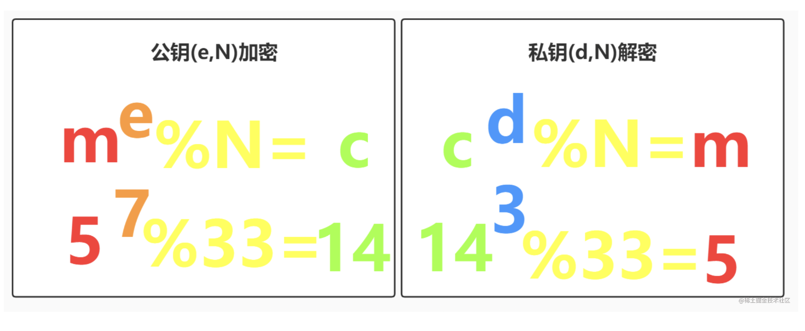

### d的计算公式

``` ts
let d = 1;
while ((e * d) % r !== 1) {
  d++;
}
console.log("求出私钥中的d", d); // 3
```

*N*和*e*我们都会公开使用，最为重要的就是私钥中的*d*，*d*一旦泄露，加密也就失去了意义。那么得到d的过程是如何的呢？如下:

1. 比如知道e和r，因为d是e关于r的模反元素；r是φ(N) 的值
2. 而*φ(N)=(p-1)(q-1)* ，所以知道p和q我们就能得到d;
3. *N = pq*，从公开的数据中我们只知道N和e，所以问题的关键就是对N做因式分解能不能得出p和q

> 核心原理：将p和q相乘得出乘积N很容易，但要是想要通过乘积N推导出p和q极难。即对两个大质数相乘得到的一个数进行因式分解极难

目前公开破译的位数是768位，实际使用一般是1024位或是2048位，所以理论上特别的安全。

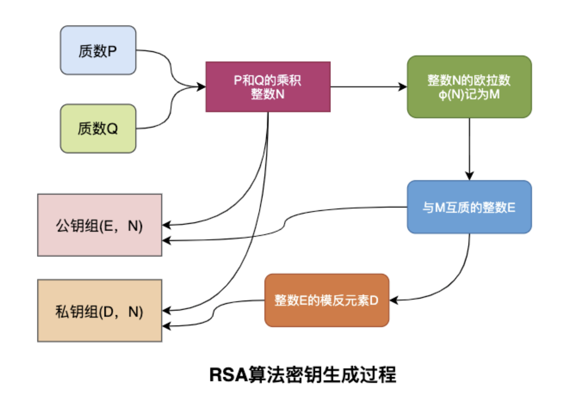

### 代码实现

``` ts
// 两个大质数，这里为了便于理解，选择小的，实际是1024位或者2048位的大质数
const p = 3;
const q = 11;
const N = p * q; // 数学上无法实现根据 N 求出 p 和 q
const r = (p - 1) * (q - 1); // 欧拉公式
const e = 7; // 挑选一个指数

// 秘钥是怎么来的，其中的一个算法
let d = 1;
while ((e * d) % r !== 1) {
  d++;
}
// console.log('求出私钥中的d', d); // 3

// 公钥 + 私钥
const publicKey = { e, N };
const privateKey = { d, N };

// 加密方法
export function RSAEncrypt(data: number) {
  return Math.pow(data, publicKey.e) % publicKey.N;
}

// 解密方法
export function RSADecrypt(data: number) {
  return Math.pow(data, privateKey.d) % privateKey.N;
}
```

### RSA的应用

- 生成一对秘钥对
- 私钥加密
- 公钥解密

``` ts
import { generateKeyPairSync, publicEncrypt, privateDecrypt } from 'crypto';

export function RSAApplicationTest() {
  // 生成一对秘钥：公钥 + 私钥
  const rsa = generateKeyPairSync('rsa', {
    modulusLength: 1024,
    publicKeyEncoding: {
      type: 'spki',
      format: 'pem',
    },
    privateKeyEncoding: {
      type: 'pkcs8',
      format: 'pem',
      cipher: 'aes-256-cbc',
      passphrase: 'passphrase',
    },
  });

  const message = 'hello';
  console.log('original', message);

  // 公钥加密后的数据
  const encryptMessage = publicEncrypt(
    rsa.publicKey,
    Buffer.from(message, 'utf8')
  );

  console.log('privateEncrypt', encryptMessage);

  // 私钥解密后的数据
  const decryptedMessage = privateDecrypt(
    {
      key: rsa.privateKey,
      passphrase: 'passphrase',
    },
    encryptMessage
  );
  console.log('publicDecrypt', decryptedMessage.toString());
}
```

## 5. 哈希

## 哈希函数

哈希函数的作用是给一个任意长度的数据生成出一个固定长度的数据

- 安全性：可以从给定的数据X计算出哈希值Y，但不能从哈希值Y计算机数据X
- 独一无二：不同的数据一定会产出不同的哈希值
- 长度固定：不管输入多大的数据,输出长度都是固定的

## 哈希碰撞

- 所谓哈希(hash),就是将不同的输入映射成独一无二的、固定长度的值（又称"哈希值"）。它是最常见的软件运算之一
- 如果不同的输入得到了同一个哈希值,就发生了哈希碰撞(collision)
- 防止哈希碰撞的最有效方法，就是扩大哈希值的取值空间
- 16个二进制位的哈希值，产生碰撞的可能性是 65536 分之一。也就是说，如果有65537个用户，就一定会产生碰撞。哈希值的长度扩大到32个二进制位，碰撞的可能性就会下降到 `4,294,967,296` 分之一

``` ts
console.log(Math.pow(2, 16)); // 65536
console.log(Math.pow(2, 32)); // 42亿
```

## 哈希分类

- 哈希还可以叫摘要(digest)、校验值(chunkSum)和指纹(fingerPrint)
- 如果两段数据完全一样,就可以证明数据是一样的
- 哈希有二种
  - 普通哈希用来做完整性校验，流行的是MD5
  - 加密哈希用来做加密,目前最流行的加密算法是 SHA256( Secure Hash Algorithm) 系列

## hash 使用

### 简单哈希

``` ts
export function simpleHash(num: number) {
  // padStart() 方法用另一个字符串填充当前字符串，以便产生的字符串达到给定的长度。填充从当前字符串的开始（左侧）应用。
  return ((num % 1024) + '').padStart(4, '0');
}

console.log(simpleHash(1)); // 0001;
console.log(simpleHash(234)); // 0234;
console.log(simpleHash(1025)); // 0001;
```

### MD5 & SHA-1

#### MD5 (消息摘要算法5)

类型：散列函数（或哈希函数）。 用途：用于生成数据（如文件或消息）的固定大小的散列值（或哈希值）。MD5主要用于确保数据完整性，验证数据是否被修改。它产生一个128位的哈希值，通常表示为32个十六进制字符。 密钥：MD5不使用密钥。它对输入数据生成一个固定长度的散列值，但这个过程不可逆，也就是说，从散列值无法恢复原始数据。

#### SHA-1 (安全哈希算法1)

类型：散列函数。 用途：与MD5类似，SHA-1用于生成数据的散列值，以确保数据的完整性。SHA-1产生一个160位的哈希值，通常表示为40个十六进制字符。 密钥：SHA-1同样不使用密钥，并且也是不可逆的。

随着时间的推移，MD5和SHA-1由于其弱点而变得越来越不安全，不再推荐用于安全敏感的应用。相比之下，AES被认为是非常安全的加密标准。

在实际应用中，AES、MD5和SHA-1可以根据需要组合使用，例如，可以使用AES加密数据，同时使用SHA-1生成数据的散列值来验证数据的完整性。但重要的是要注意，MD5和SHA-1已经被认为是不安全的，推荐使用更安全的散列函数，如SHA-256。

### MD5

MD5 Message-Digest Algorithm）

实现原理：数据填充 + 添加消息长度 + 分组处理

1. 首先将消息以512位为一分组进行处理，分为N组
1. 将每组消息N(i)进行4轮变换（四轮主循环），以上面所说4个常数首先赋值给a、b、c、d为起始变量进行计算，重新输出4个变量，并重新赋值给a、b、c、d四个值。
1. 以第2步获得的新的a、b、c、d四个值，再进行下一分组的运算，如果已经是最后一个分组，则这4个变量的最后结果按照从低内存到高内存排列起来，共128位，这就是MD5算法的输出。

``` ts
const data = 'hello';
// update(data + data) 等于 update(data).update(data)
const md5Hash = crypto
  .createHash('md5')
  .update(data + data)
  .digest('hex'); // 把结果输出成16进制的字符串

// 一个md5hash值长度为32位，不是很安全
console.log('md5Hash', md5Hash, md5Hash.length);
```

### sha256

``` ts
const data = 'hello';

// 盐值，为了更加安全，不容易预测
const salt = '666';
// 把结果输出成16进制的字符串
const sha256Hash = crypto
  .createHmac('sha256', salt)
  .update(data)
  .digest('hex');
console.log('sha256Hash', sha256Hash, sha256Hash.length);
```

# 数字签名

## 原理

数字签名的基本原理是用私钥去签名，而用公钥去验证签名

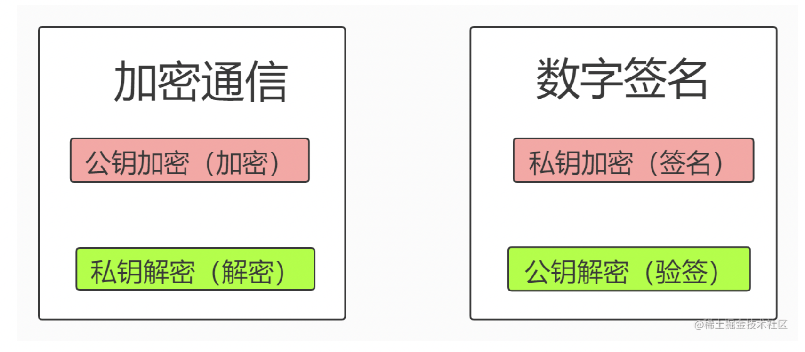

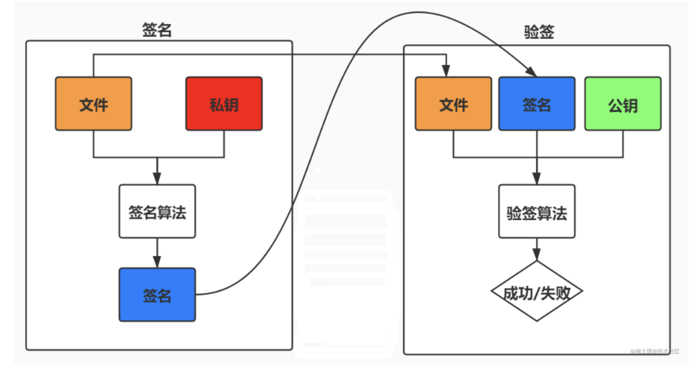

## 应用

``` ts
import { generateKeyPairSync, createSign, createVerify } from 'crypto';

/**
 * 数字签名和数字证书的过程
 * 1、先拿到文件file
 * 2、用 publicKey 计算签名 sign
 * 3、如果跟对方的 sign 匹配，验证通过
 */
export function signTest() {
  const rsa = generateKeyPairSync('rsa', {
    modulusLength: 1024,
    publicKeyEncoding: {
      type: 'spki',
      format: 'pem',
    },
    privateKeyEncoding: {
      type: 'pkcs8',
      format: 'pem',
      cipher: 'aes-256-cbc',
      passphrase: 'passphrase', // 私钥的密码
    },
  });

  const file = 'file';
  // 创建签名对象
  const signObj = createSign('RSA-SHA256');
  // 放入内容
  signObj.update(file);
  // 用rsa私钥签名，输出一个16进制的字符串
  const sign = signObj.sign({
    key: rsa.privateKey,
    format: 'pem',
    passphrase: 'passphrase',
  });

  console.log(sign);

  // 创建验证签名对象
  const verifyObj = createVerify('RSA-SHA256');
  // 放入文件内容
  verifyObj.update(file);
  // 验证签名是否合法
  const isValid = verifyObj.verify(rsa.publicKey, sign);

  console.log(isValid);
}
```

# 7. 数字证书

数字证书是一个由可信的第三方发出的，用来证明所有人身份以及所有人拥有某个公钥的电子文件

一个数字证书通常包含了：

- 公钥；
- 持有者信息；
- 证书认证机构（CA）的信息；
- CA 对这份文件的数字签名及使用的算法；
- 证书有效期；
- 还有一些其他额外信息；

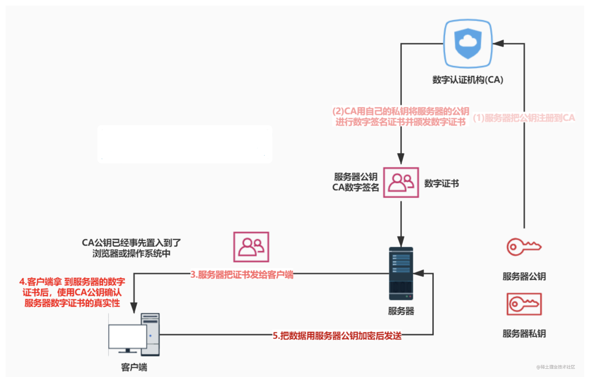

## 证书签发

> 直接对内容进行rsa签名，性能太差，先使用摘要算法，根据内容算出一个摘要签名
>
> 然后再使用rsa算法对摘要签名进行签名

- 首先 CA 会把持有者的公钥、用途、颁发者、有效时间等信息打成一个包，然后对这些信息进行 Hash 计算，得到一个 Hash 值；
- 然后 CA 会使用自己的私钥将该 Hash 值加密，生成 Certificate Signature，也就是 CA 对证书做了签名；
- 最后将 Certificate Signature 添加在文件证书上，形成数字证书；

## 证书校验

- 首先客户端会使用同样的 Hash 算法获取该证书的 Hash 值 H1；
- 通常浏览器和操作系统中集成了 CA 的公钥信息，浏览器收到证书后可以使用 CA 的公钥解密 Certificate Signature 内容，得到一个 Hash 值 H2 ；
- 最后比较 H1 和 H2，如果值相同，则为可信赖的证书，否则则认为证书不可信。

## 证书链

证书的验证过程中还存在一个证书信任链的问题，因为我们向 CA 申请的证书一般不是根证书签发的，而是由中间证书签发的，比如百度的证书，从下图你可以看到，证书的层级有三级：

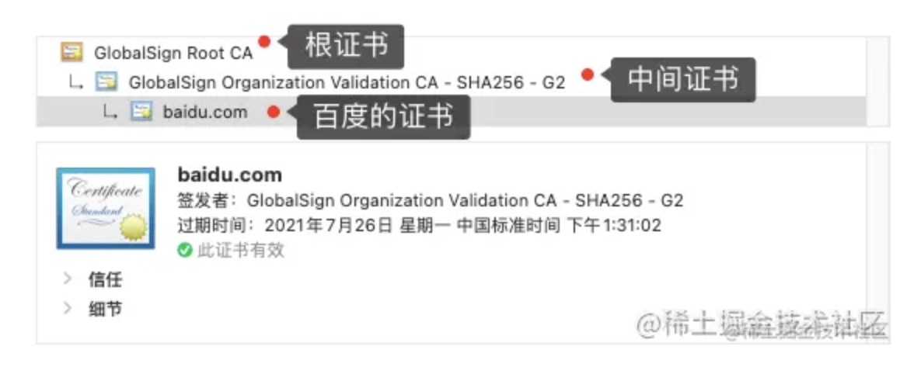

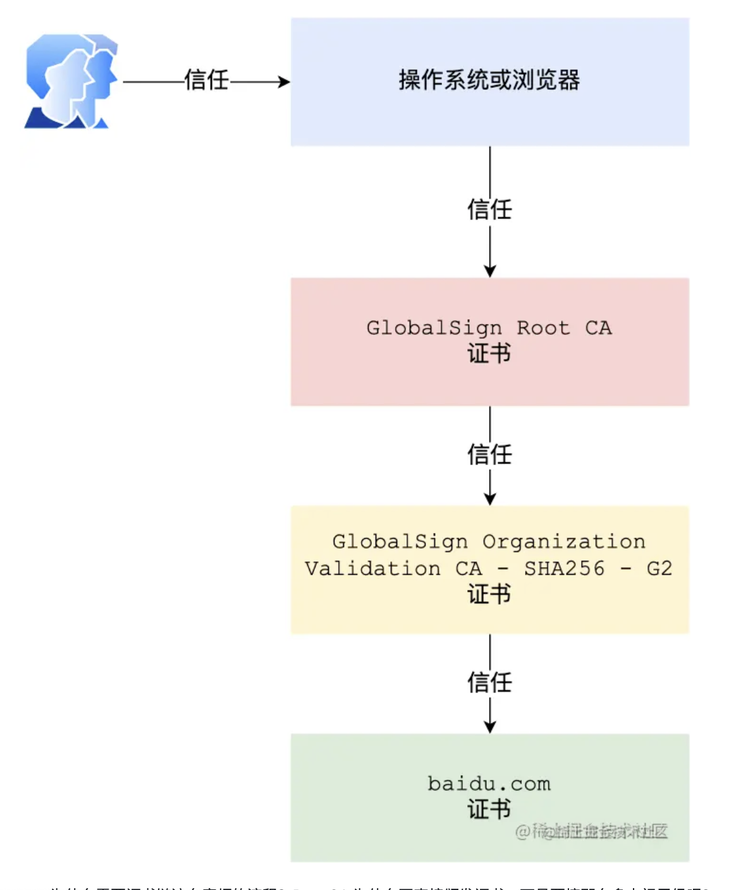

- 为什么需要证书链这么麻烦的流程？Root CA 为什么不直接颁发证书，而是要搞那么多中间层级呢？

这是为了确保根证书的绝对安全性，将根证书隔离地越严格越好，不然根证书如果失守了，那么整个信任链都会有问题。

为什么数字证书中，要引入第三方管理机构，不能直接端到端的数字签名？

- 数字证书中引入第三方管理机构，通常是指证书颁发机构（CA，Certificate Authority），这样做主要是为了解决信任和身份验证问题。如果仅仅是端到端的数字签名，虽然可以确保消息的完整性和非抵赖性，但存在以下几个问题：
- 身份验证：如何确认公钥确实属于声称的拥有者？在没有第三方认证的情况下，两个通信方很难相互验证对方的身份。比如，Alice想要通过Bob的公钥加密信息发送给他，但Alice如何确信这个公钥真的属于Bob，而不是中间人伪装的呢？
- 信任链：数字证书和CA构建了一个信任链。用户只需要信任CA，就能通过CA来验证证书的真实性，从而信任证书中的公钥属于声明的主体。这个过程减少了用户需要直接管理和验证公钥的复杂性。
- 撤销和更新：当密钥被泄露或不再安全时，需要有一个机制来撤销密钥。CA可以发布证书撤销列表（CRL，Certificate Revocation List）或通过在线证书状态协议（OCSP，Online Certificate Status Protocol）来通知用户哪些证书不再可信。如果只是端到端直接使用公钥，这种更新和撤销机制难以实现。

## 模拟应用

``` ts
import { createSign, createVerify } from 'crypto';

// 获取签名
export function getSign(
  content: string,
  privateKey: string,
  passphrase: string
) {
  // 创建签名对象
  var signObj = createSign('RSA-SHA256');
  // 放入内容
  signObj.update(content);
  // 签名算法
  return signObj.sign(
    {
      key: privateKey,
      format: 'pem',
      passphrase,
    },
    'hex'
  );
}

// 验证签名
export function verifySign(content: string, sign: string, publicKey: string) {
  const verifyObj = createVerify('RSA-SHA256');
  verifyObj.update(content);
  return verifyObj.verify(publicKey, sign, 'hex');
}
```

``` ts
import { generateKeyPairSync, createHash } from 'crypto';
import { getSign, verifySign } from '../src/cert';

/**
 * 实现数字证书的原理
 */
export function certTest() {
  // 服务器生成的公钥和私钥
  const serverRSA = generateKeyPairSync('rsa', {
    modulusLength: 1024,
    publicKeyEncoding: {
      type: 'spki',
      format: 'pem', // base64格式的私钥
    },
    privateKeyEncoding: {
      type: 'pkcs8',
      format: 'pem',
      cipher: 'aes-256-cbc',
      passphrase: 'passphrase', // 私钥的密码, 提高窃取成本
    },
  });

  // CA 的公钥和私钥
  const caRSA = generateKeyPairSync('rsa', {
    modulusLength: 1024,
    publicKeyEncoding: {
      type: 'spki',
      format: 'pem', // base64格式的私钥
    },
    privateKeyEncoding: {
      type: 'pkcs8',
      format: 'pem',
      cipher: 'aes-256-cbc',
      passphrase: 'passphrase', // 私钥的密码, 提高窃取成本
    },
  });

  // 网站的信息
  const info = {
    domain: 'http://127.0.0.1:8080',
    publicKey: serverRSA.publicKey,
  };

  // 把申请信息发给CA机构请求颁发证书
  // 真正实现的时候，签名的不是info，而是它的hash
  // 签名算法性能很差，一般不能计算大量的数据
  const hash = createHash('sha256').update(JSON.stringify(info)).digest('hex'); // hex生成16进制的一个字符串

  // 使用CA的私钥进行签名
  const sign = getSign(hash, caRSA.privateKey, 'passphrase');

  // 证书
  const cert = {
    info,
    hash,
    sign, // CA的签名
  };

  // 验证证书合法性
  const isValid = verifySign(cert.hash, cert.sign, caRSA.publicKey);
  console.log('验证证书合法性', isValid);

  // 拿到服务器的公钥 serverPublicKey，可进行加密数据传输
  const serverPublicKey = cert.info.publicKey;
}
```

# 8. Diffie-Hellman 算法

## 原理

Diffie-Hellman算法是一种密钥交换协议，它可以让双方在不泄漏密钥的情况下协商出一个密钥来

Diffie-Hellman算法是非对称加密算法，该算法的核心数学思想是离散对数。

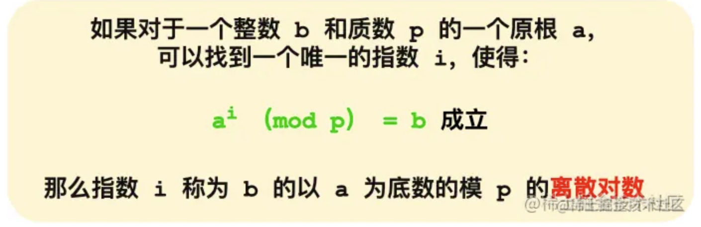

上图的，底数 a 和模数 p 是离散对数的公共参数，也就说是公开的，b 是真数，i 是对数。知道了对数，就可以用上面的公式计算出真数。但反过来，知道真数却很难推算出对数。

特别是当模数 p 是一个很大的质数，即使知道底数 a 和真数 b ，在现有的计算机的计算水平是几乎无法算出离散对数的，这就是 DH 算法的数学基础。

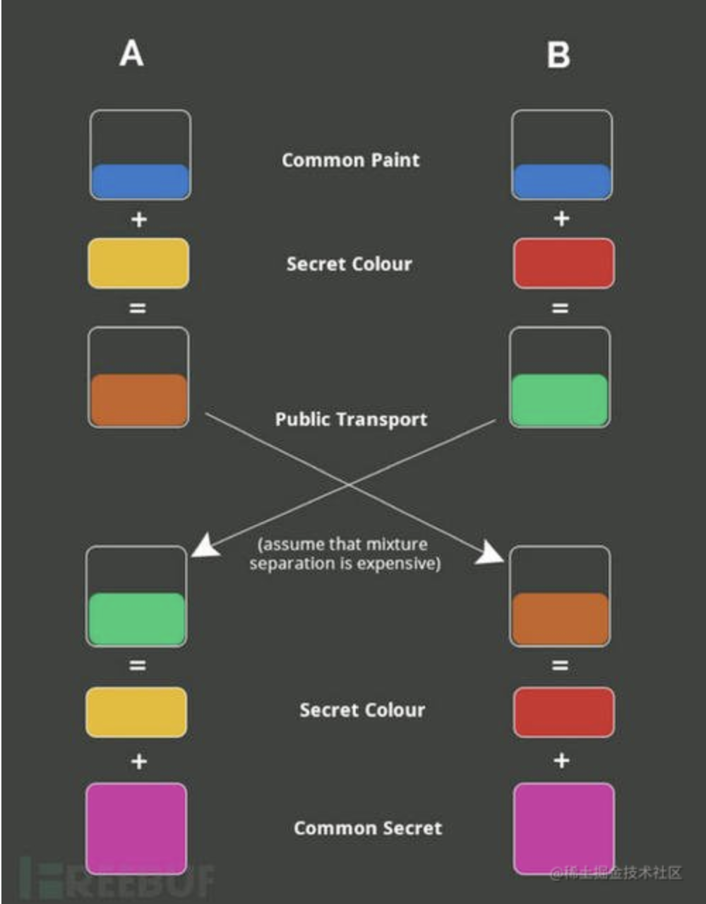

## 实现原理的伪代码

``` ts
export function diffieHellmanTest() {
  const N = 23; // 公共
  const p = 5;
  const secret1 = 6;

  const A = Math.pow(p, secret1) % N;
  console.log(`p=${p}; N=${N}; A=${A};`);

  const secret2 = 15;
  const B = Math.pow(p, secret2) % N;
  console.log(`p=${p}; N=${N}; B=${B};`);

  // A将A、p、N给B
  // B计算后将B给A
  // 这样A拥有，A、B、p、N、secret1
  // 这样B拥有，A、B、p、N、secret2

  // A这样计算的
  console.log(Math.pow(B, secret1) % N);
  // B这样计算的
  console.log(Math.pow(A, secret2) % N);
}
```

## 应用

``` ts
import { createDiffieHellman } from 'crypto';

export function diffieHellmanApplication() {
  // 客户端
  const client = createDiffieHellman(512); // 512字节
  // 生成一个秘钥对
  const clientKeys = client.generateKeys();
  // 生成一个质数
  const prime = client.getPrime();
  const generator = client.getGenerator();

  // 服务器端
  const server = createDiffieHellman(prime as unknown as number, generator);
  // 生成一个秘钥对
  const serverKeys = server.generateKeys();

  // 双方生成秘钥
  let client_secret = client.computeSecret(serverKeys);
  let server_secret = server.computeSecret(clientKeys);

  console.log('client_secret', client_secret.toString('hex'));
  console.log('server_secret', server_secret.toString('hex'));
}
```

# 9. ECC

椭圆曲线加密算法(ECC) 是基于椭圆曲线数学的一种公钥加密的算法


其中涉及的数学知识过于复杂，只要记住与传统的基于大质数因子分解困难性的加密方法不同，ECC通过椭圆曲线方程式的性质产生密钥

## ECC vs RSA 对比


## ECC缺点

- 设计困难，实现复杂

# 10. ECDHE

ECDHE 是使用椭圆曲线（ECC）的 DH（Diffie-Hellman）算法，ECDHE 算法是在 DHE 算法的基础上利用了 ECC 椭圆曲线特性，可以用更少的计算量计算出公钥，以及最终的会话密钥。

> ## 关键概念
>
> - 椭圆曲线：公开的
> - 基点G：公开的
> - 生成一个随机数d，做为私钥（d1，d2）
> - 计算得到公钥Q（Q=dG）
> - 交换公钥
> - 计算点 (x, y) = dQ
> - x坐标是一样的，所以它是共享密钥，也就是会话密钥

## 举例

小红和小明使用 ECDHE 密钥交换算法的过程：

- 双方事先确定好使用哪种椭圆曲线，和曲线上的基点
G，这两个参数都是公开的；
- 双方各自随机生成一个随机数作为**私钥d**，并与基点
G相乘得到**公钥Q**（Q = dG），此时小红的公私钥为 Q1 和
d1，小明的公私钥为 Q2 和 d2；
- 双方交换各自的公钥，最后小红计算点（x1，y1） = d1Q2，小明计算点（x2，y2） = d2Q1，由于椭圆曲线上是可以满足乘法交换和结合律，所以 d1Q2 = d1d2G = d2d1G = d2Q1 ，因此**双方的 x 坐标是一样的，所以它是共享密钥，也就是会话密钥**。

这个过程中，双方的私钥都是随机、临时生成的，都是不公开的，即使根据公开的信息（椭圆曲线、公钥、基点G）也是很难计算出椭圆曲线上的离散对数（私钥）。

# HTTPS 秘钥协商

## TLS

HTTP 由于是明文传输，所谓的明文，就是说客户端与服务端通信的信息都是肉眼可见的，随意使用一个抓包工具都可以截获通信的内容。

所以安全上存在以下三个风险：

- 窃听风险，比如通信链路上可以获取通信内容，用户号容易没。
- 篡改风险，比如强制植入垃圾广告，视觉污染，用户眼容易瞎。
- 冒充风险，比如冒充淘宝网站，用户钱容易没。

HTTPS 在 HTTP 与 TCP 层之间加入了 TLS 协议，来解决上述的风险。

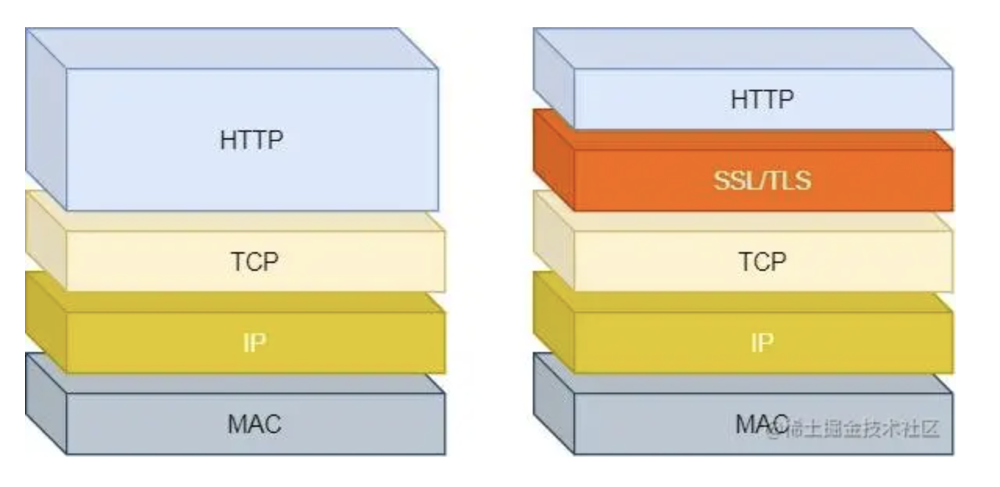

TLS 协议是如何解决 HTTP 的风险的呢？

- 信息加密： HTTP 交互信息是被加密的，第三方就无法被窃取；
- 校验机制：校验信息传输过程中是否有被第三方篡改过，如果被篡改过，则会有警告提示；
- 身份证书：证明淘宝是真的淘宝网；

可见，有了 TLS 协议，能保证 HTTP 通信是安全的了，那么在进行 HTTP 通信前，需要先进行 TLS 握手。TLS 的握手过程，如下图：

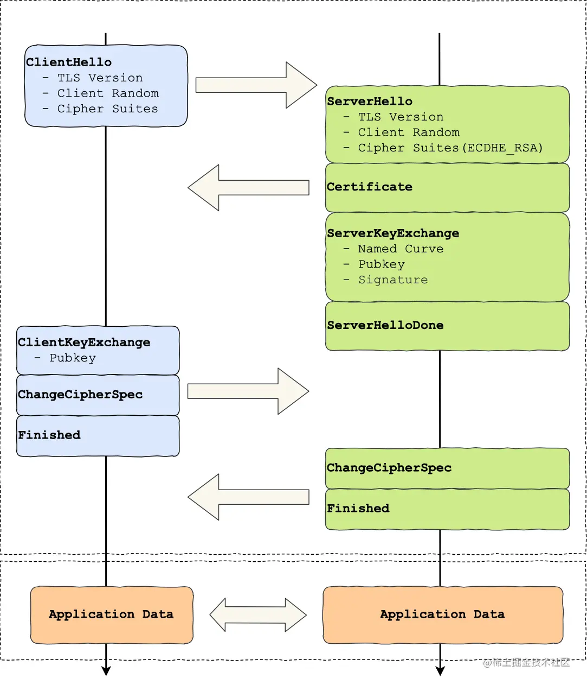

上图简要概述来 TLS 的握手过程，其中每一个「框」都是一个记录（record），记录是 TLS 收发数据的基本单位，类似于 TCP 里的 segment。多个记录可以组合成一个 TCP 包发送，所以通常经过「四个消息」就可以完成 TLS 握手，也就是需要 2个 RTT 的时延，然后就可以在安全的通信环境里发送 HTTP 报文，实现 HTTPS 协议。

所以可以发现，HTTPS 是应用层协议，需要先完成 TCP 连接建立，然后走 TLS 握手过程后，才能建立通信安全的连接。
事实上，不同的密钥交换算法，TLS 的握手过程可能会有一些区别。

这里先简单介绍下密钥交换算法，因为考虑到性能的问题，所以双方在加密应用信息时使用的是对称加密密钥，而对称加密密钥是不能被泄漏的，为了保证对称加密密钥的安全性，所以使用非对称加密的方式来保护对称加密密钥的协商，这个工作就是密钥交换算法负责的。
接下来，我们就以最简单的 RSA 密钥交换算法，来看看它的 TLS 握手过程。

## RSA秘钥协商

传统的 TLS 握手基本都是使用 RSA 算法来实现密钥交换的，在将 TLS 证书部署服务端时，证书文件中包含一对公私钥，其中公钥会在 TLS 握手阶段传递给客户端，私钥则一直留在服务端，一定要确保私钥不能被窃取。

在 RSA 密钥协商算法中，客户端会生成随机密钥，并使用服务端的公钥加密后再传给服务端。根据非对称加密算法，公钥加密的消息仅能通过私钥解密，这样服务端解密后，双方就得到了相同的密钥，再用它加密应用消息。

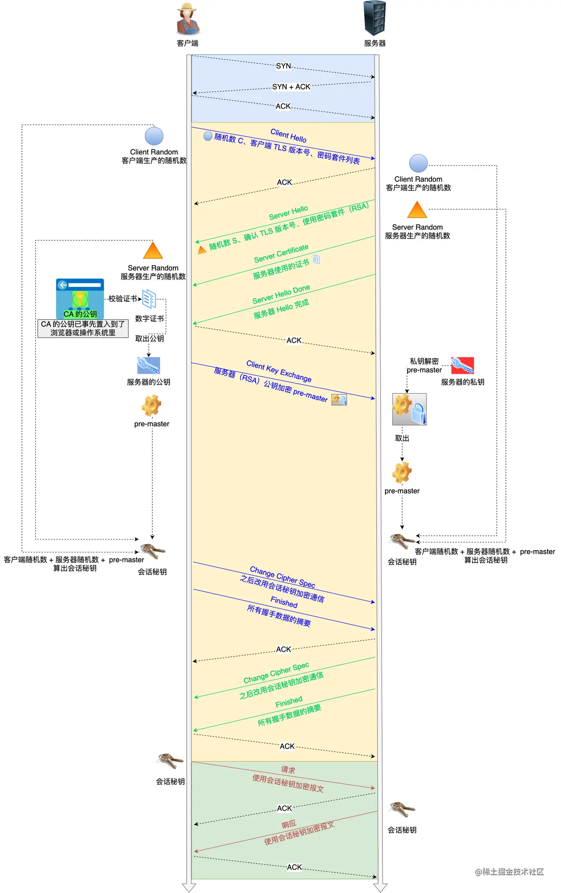

### 第一次握手

客户端首先会发一个「Client Hello」消息，字面意思我们也能理解到，这是跟服务器「打招呼」。消息里面有客户端使用的 TLS 版本号、支持的密码套件列表，以及生成的随机数（Client Random），这个随机数会被服务端保留，它是生成对称加密密钥的材料之一。

### 第二次握手

当服务端收到客户端的「Client Hello」消息后，会确认 TLS 版本号是否支持，和从密码套件列表中选择一个密码套件，以及生成随机数（Server Random）。

接着，返回「Server Hello」消息，消息里面有服务器确认的 TLS 版本号，也给出了随机数（Server Random），然后从客户端的密码套件列表选择了一个合适的密码套件。

这个密码套件它是有固定格式和规范的。基本的形式是「密钥交换算法 + 签名算法 + 对称加密算法 + 摘要算法」， 一般 WITH 单词前面有两个单词，第一个单词是约定密钥交换的算法，第二个单词是约定证书的验证算法。

就前面这两个客户端和服务端相互「打招呼」的过程，客户端和服务端就已确认了 TLS 版本和使用的密码套件，而且你可能发现客户端和服务端都会各自生成一个随机数，并且还会把随机数传递给对方。

那这个随机数有啥用呢？其实这两个随机数是后续作为生成「会话密钥」的条件，所谓的会话密钥就是数据传输时，所使用的对称加密密钥。

然后，服务端为了证明自己的身份，会发送「Server Certificate」给客户端，这个消息里含有数字证书。

随后，服务端发了「Server Hello Done」消息，目的是告诉客户端，我已经把该给你的东西都给你了，本次打招呼完毕。

#### 客户端验证证书

在这里刹个车，客户端拿到了服务端的数字证书后，要怎么校验该数字证书是真实有效的呢？

数字证书和 CA 机构

在说校验数字证书是否可信的过程前，我们先来看看数字证书是什么，一个数字证书通常包含了：

公钥；
持有者信息；
证书认证机构（CA）的信息；
CA 对这份文件的数字签名及使用的算法；
证书有效期；
还有一些其他额外信息；

那数字证书的作用，是用来认证公钥持有者的身份，以防止第三方进行冒充。说简单些，证书就是用来告诉客户端，该服务端是否是合法的，因为只有证书合法，才代表服务端身份是可信的。

我们用证书来认证公钥持有者的身份（服务端的身份），那证书又是怎么来的？又该怎么认证证书呢？

为了让服务端的公钥被大家信任，服务端的证书都是由 CA （Certificate Authority，证书认证机构）签名的，CA 就是网络世界里的公安局、公证中心，具有极高的可信度，所以由它来给各个公钥签名，信任的一方签发的证书，那必然证书也是被信任的。
之所以要签名，是因为签名的作用可以避免中间人在获取证书时对证书内容的篡改。

数字证书签发和验证流程

如下图图所示，为数字证书签发和验证流程:

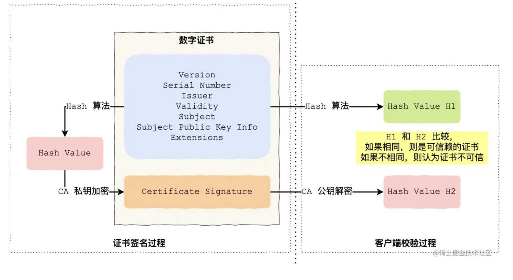

CA 签发证书的过程，如上图左边部分：

- 首先 CA 会把持有者的公钥、用途、颁发者、有效时间等信息打成一个包，然后对这些信息进行 Hash 计算，得到一个 Hash 值；
- 然后 CA 会使用自己的私钥将该 Hash 值加密，生成 Certificate Signature，也就是 CA 对证书做了签名；
- 最后将 Certificate Signature 添加在文件证书上，形成数字证书；

客户端校验服务端的数字证书的过程，如上图右边部分：

- 首先客户端会使用同样的 Hash 算法获取该证书的 Hash 值 H1；
- 通常浏览器和操作系统中集成了 CA 的公钥信息，浏览器收到证书后可以使用 CA 的公钥解密 Certificate Signature 内容，得到一个 Hash 值 H2 ；
- 最后比较 H1 和 H2，如果值相同，则为可信赖的证书，否则则认为证书不可信。

### 第三次握手

客户端验证完证书后，认为可信则继续往下走。接着，客户端就会生成一个新的随机数 (pre-master)，用服务器的 RSA 公钥加密该随机数，通过「Change Cipher Key Exchange」消息传给服务端。

服务端收到后，用 RSA 私钥解密，得到客户端发来的随机数 (pre-master)。

至此，客户端和服务端双方都共享了三个随机数，分别是 Client Random、Server Random、pre-master。

于是，双方根据已经得到的三个随机数，生成会话密钥（Master Secret），它是对称密钥，用于对后续的 HTTP 请求/响应的数据加解密。

生成完会话密钥后，然后客户端发一个「Change Cipher Spec」，告诉服务端开始使用加密方式发送消息。

然后，客户端再发一个「Encrypted Handshake Message（Finishd）」消息，把之前所有发送的数据做个摘要，再用会话密钥（master secret）加密一下，让服务器做个验证，验证加密通信是否可用和之前握手信息是否有被中途篡改过。

可以发现，「Change Cipher Spec」之前传输的 TLS 握手数据都是明文，之后都是对称密钥加密的密文。

### 第四次握手

服务器也是同样的操作，发「Change Cipher Spec」和「Encrypted Handshake Message」消息，如果双方都验证加密和解密没问题，那么握手正式完成。

最后，就用「会话密钥」加解密 HTTP 请求和响应了。

## RSA 算法的缺陷

使用 RSA 密钥协商算法的最大问题是不支持前向保密。因为客户端传递随机数（用于生成对称加密密钥的条件之一）给服务端时使用的是公钥加密的，服务端收到到后，会用私钥解密得到随机数。所以一旦服务端的私钥泄漏了，过去被第三方截获的所有 TLS 通讯密文都会被破解。

为了解决这一问题，于是就有了 DH 密钥协商算法，这里简单介绍它的工作流程。

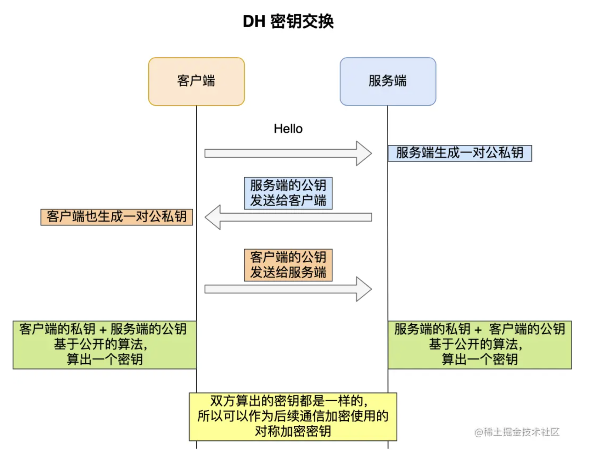

客户端和服务端各自会生成随机数，并以此作为私钥，然后根据公开的 DH 计算公示算出各自的公钥，通过 TLS 握手双方交换各自的公钥，这样双方都有自己的私钥和对方的公钥，然后双方根据各自持有的材料算出一个随机数，这个随机数的值双方都是一样的，这就可以作为后续对称加密时使用的密钥。

DH 密钥交换过程中，即使第三方截获了 TLS 握手阶段传递的公钥，在不知道的私钥的情况下，也是无法计算出密钥的，而且每一次对称加密密钥都是实时生成的，实现前向保密。

但因为 DH 算法的计算效率问题，后面出现了 ECDHE 密钥协商算法，我们现在大多数网站使用的正是 ECDHE 密钥协商算法，

## ECDHE 秘钥协商

### 第一次握手

客户端首先会发一个「**Client Hello**」消息，消息里面有客户端使用的 TLS 版本号、支持的密码套件列表，以及生成的**随机数（*Client Random*）**。

### 第二次握手

服务端收到客户端的「打招呼」，同样也要回礼，会返回「**Server Hello**」消息，消息面有服务器确认的 TLS 版本号，也给出了一个**随机数（*Server Random*）**，然后从客户端的密码套件列表选择了一个合适的密码套件。

不过，这次选择的密码套件就和 RSA 不一样了，我们来分析一下这次的密码套件的意思。

「 TLS_ECDHE_RSA_WITH_AES_256_GCM_SHA384」

- 密钥协商算法使用 ECDHE；
- 签名算法使用 RSA；
- 握手后的通信使用 AES 对称算法，密钥长度 256 位，分组模式是 GCM；
- 摘要算法使用 SHA384；

接着，服务端为了证明自己的身份，发送「**Certificate**」消息，会把证书也发给客户端。

这一步就和 RSA 握手过程有很大到区别了，因为服务端选择了 ECDHE 密钥协商算法，所以会在发送完证书后，发送「**Server Key Exchange**」消息。

这个过程服务器做了三件事：

- 选择了**名为 named_curve 的椭圆曲线**，选好了椭圆曲线相当于椭圆曲线基点 G 也定好了，这些都会公开给客户端；
- 生成随机数作为服务端椭圆曲线的私钥，保留到本地；
- 根据基点 G 和私钥计算出**服务端的椭圆曲线公钥**，这个会公开给客户端。

为了保证这个椭圆曲线的公钥不被第三方篡改，服务端会用 RSA 签名算法给服务端的椭圆曲线公钥做个签名。

随后，就是「**Server Hello Done**」消息，服务端跟客户端表明：“这些就是我提供的信息，打招呼完毕”。

至此，TLS 两次握手就已经完成了，目前客户端和服务端通过明文共享了这几个信息：**Client Random、Server Random 、使用的椭圆曲线、椭圆曲线基点 G、服务端椭圆曲线的公钥**，这几个信息很重要，是后续生成会话密钥的材料。

### 第三次握手

客户端收到了服务端的证书后，自然要校验证书是否合法，如果证书合法，那么服务端到身份就是没问题的。校验证书到过程，会走证书链逐级验证，确认证书的真实性，再用证书的公钥验证签名，这样就能确认服务端的身份了，确认无误后，就可以继续往下走。

客户端会生成一个随机数作为客户端椭圆曲线的私钥，然后再根据服务端前面给的信息，生成**客户端的椭圆曲线公钥**，然后用「**Client Key Exchange**」消息发给服务端。

至此，双方都有对方的椭圆曲线公钥、自己的椭圆曲线私钥、椭圆曲线基点 G。于是，双方都就计算出点（x，y），其中 x 坐标值双方都是一样的，前面说 ECDHE 算法时候，说  x 是会话密钥，**但实际应用中，x 还不是最终的会话密钥**。

还记得 TLS 握手阶段，客户端和服务端都会生成了一个随机数传递给对方吗？

**最终的会话密钥，就是用「客户端随机数 + 服务端随机数 + x（ECDHE 算法算出的共享密钥） 」三个材料生成的**。

之所以这么麻烦，是因为 TLS 设计者不信任客户端或服务器「伪随机数」的可靠性，为了保证真正的完全随机，把三个不可靠的随机数混合起来，那么「随机」的程度就非常高了，足够让黑客计算出最终的会话密钥，安全性更高。

算好会话密钥后，客户端会发一个「**Change Cipher Spec**」消息，告诉服务端后续改用对称算法加密通信。

接着，客户端会发「**Encrypted Handshake Message**」消息，把之前发送的数据做一个摘要，再用对称密钥加密一下，让服务端做个验证，验证下本次生成的对称密钥是否可以正常使用。

### 第四次握手

最后，服务端也会有一个同样的操作，发「**Change Cipher Spec**」和「**Encrypted Handshake Message**」消息，如果双方都验证加密和解密没问题，那么握手正式完成。于是，就可以正常收发加密的 HTTP 请求和响应了。

## RSA / ECDHE 对比

- RSA 密钥协商算法「不支持」前向保密（ECDH和DH也不支持），ECDHE 密钥协商算法「支持」前向保密（DHE支持）；
- 使用了 RSA 密钥协商算法，TLS 完成四次握手后，才能进行应用数据传输，而对于 ECDHE 算法，客户端可以不用等服务端的最后一次 TLS 握手，就可以提前发出加密的 HTTP 数据，节省了一个消息的往返时间；
- 使用 ECDHE， 在 TLS 第 2 次握手中，会出现服务器端发出的「Server Key Exchange」消息，而 RSA 握手过程没有该消息；

# 扩展问题

- SSL 连接断开后如何恢复?
- 301、302 的 https 被挟持怎么办?
- HTTPS 中间人攻击

## SSL 连接断开后如何恢复?

一共有两种方法来恢复断开的 SSL 连接，一种是使用 session ID，一种是 session ticket。

- 使用 session ID 的方式，每一次的会话都有一个编号，当对话中断后，下一次重新连接时，只要客户端给出这个编号，服务器如果有这个编号的记录，那么双方就可以继续使用以前的秘钥，而不用重新生成一把。 目前所有的浏览器都支持这一种方法。 但是这种方法有一个缺点是，session ID 只能够存在一台服务器上，如果我们的请求通过负载平衡被转移到了其他的服务器上，那么就无法恢复对话。
- 另一种方式是 session ticket 的方式，session ticket 是服务器在上一次对话中发送给客户的，这个 ticket 是加密的，只有服务器能够解密，里面包含了本次会话的信息，比如对话秘钥和加密方法等。 这样不管我们的请求是否转移到其他的服务器上，当服务器将 ticket 解密以后，就能够获取上次对话的信息，就不用重新生成对话秘钥了。

## 301、302 的 https 被挟持怎么办?

首先，301是永久重定向，302是临时重定向。

一般301使用的情况有：

1.http网站跳转到https网站
2.二级域名跳转到主域名
3.404页面失效跳转到新的页面
4.老的域名跳转到新的域名

302使用的情况是不太常见的，一般是网站在短时间内改版，在不影响用户体验的情况下，临时吧页面跳转到临时页面。

因为在将 http 请求重定向到 https 的过程中，存在中间人攻击的风险，那么就可能被劫持。解决该问题的方案为采用 HSTS 策略，通过 307 Internal Redirect 来代替 301 Move Permanently。

- 合理使用 HSTS

什么是 HSTS 呢?HSTS(HTTP Strict Transport Security,HTTP 严格传输安全协议)表明网站已经实现了 TLS，要求浏览器对用户明文访问的 URL 重写成了 HTTPS，避免始终强制 302 重定向的延时开销。

- HSTS 的实现原理

当浏览器第一次 HTTP 请求服务器时，返回的响应头中增加`Strict-Transport-Security`，告诉浏览器指定时间内，这个网站必须通过 HTTPS 协议来访问。也就是对于这个网站的 HTTP 地址，浏览器需要现在本地替换为 HTTPS 之后再发送请求。

## HTTPS 中间人攻击

中间人攻击过程如下：

- 服务器向客户端发送公钥；
- 攻击者截获公钥，保留在自己手上；
- 然后攻击者自己生成一个【伪造的】公钥，发给客户端；
- 客户端收到伪造的公钥后，生成加密 hash（秘钥） 值发给服务器；
- 攻击者获得加密 hash 值，用自己的私钥解密获得真秘钥；
- 同时生成假的加密 hash 值，发给服务器；
- 服务器用私钥解密获得假秘钥；
- 服务器用假秘钥加密传输信息；

防范方法：

服务器在发送浏览器的公钥中加入 CA 证书，浏览器可以验证 CA 证书的有效性；（现有 HTTPS 很难被劫持，除非信任了劫持者的 CA 证书）。

# 参考链接

- [TLS/SSL 协议详解 (30) SSL中的RSA、DHE、ECDHE、ECDH流程与区别](https://blog.csdn.net/PUSONG568/article/details/81008022)
- [为了搞懂 HTTPS，我把大学的数学书拿了出来。。。](https://juejin.cn/post/6920887234119860232#heading-7)
- [几幅图，拿下 HTTPS](https://juejin.cn/post/6917224067032416263#heading-0)
- [ECC椭圆曲线加密算法](https://juejin.cn/post/6844903889284628488#heading-10)
